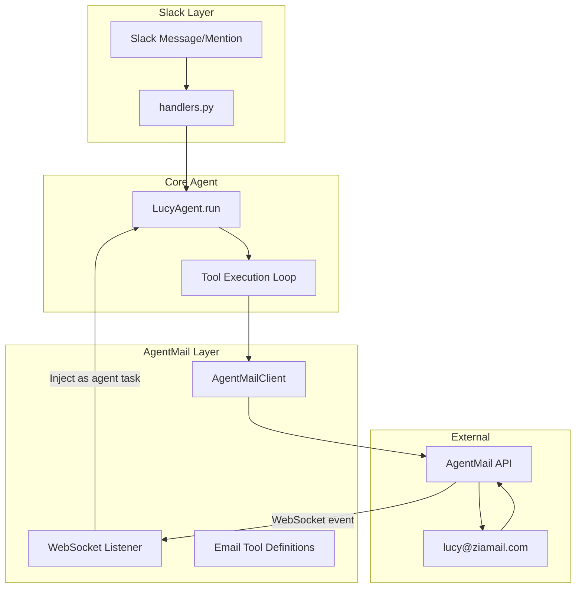

# AgentMail Email Integration for Lucy

## Phase 0: Git Branch Setup

The current branch is `lucy-openrouter-v2` with uncommitted changes (13 modified files, 3 deleted, 16 untracked). Before doing anything:

1. **Stash or commit current work** on `lucy-openrouter-v2` so nothing is lost
2. **Create a new branch** `feature/agentmail-email` from `lucy-openrouter-v2` for all email integration work
3. This keeps the main development branch clean and the email feature isolated for an easy merge later

```bash
git stash  # or commit current changes
git checkout -b feature/agentmail-email
```

---

## Phase 1: Domain Setup Guide (Manual Steps for You)

Before any code is written, `zeeyamail.com` must be registered and verified with AgentMail. Here is the exact procedure:

### 1.1 Prerequisites

- **AgentMail account** on a paid plan (custom domains require upgrade): [console.agentmail.to](https://console.agentmail.to)
- **AgentMail API key** created from the console dashboard
- **DNS access** to `ziamail.com` (wherever the domain is registered -- Cloudflare, Namecheap, Route 53, etc.)

### 1.2 Register Domain via API

```python
from agentmail import AgentMail

client = AgentMail(api_key="YOUR_AGENTMAIL_API_KEY")
domain = client.domains.create(domain="ziamail.com", feedback_enabled=True)

print("Status:", domain.status)  # Will be "PENDING"
print("DNS Records:", domain.records)
```

This returns a `records` array with DNS entries you must add. Expect approximately:

- **3 TXT records**: SPF (`v=spf1 include:spf.agentmail.to -all`), DKIM (long key), DMARC (`v=DMARC1; p=reject; ...`)
- **1-2 MX records**: pointing to AgentMail's inbound SMTP servers
- Each record has `name`, `type`, `value`, `priority`, and `status` fields

### 1.3 Add DNS Records

Go to your DNS provider for `ziamail.com` and add each record exactly as returned by the API. The easiest method is downloading the BIND zone file from the AgentMail console and importing it.

**Critical notes**:

- If using AWS Route 53, DKIM values longer than 255 chars must be split into two quoted strings with NO space between them: `"first-part""second-part"`
- Only one SPF record is allowed per domain. If other services already send email from `ziamail.com`, merge the `include:spf.agentmail.to` into the existing SPF record
- Porkbun zone file uploads REPLACE existing records -- be careful if the domain has other DNS entries

### 1.4 Verify Domain

After adding DNS records, trigger verification:

```python
domain = client.domains.get("ziamail.com")
print("Status:", domain.status)
# PENDING -> VERIFYING -> VERIFIED (can take minutes to 48 hours)
```

Or use the console at [console.agentmail.to/dashboard/domains](https://console.agentmail.to/dashboard/domains) to monitor. The domain must reach `VERIFIED` status before inboxes can use it.

### 1.5 What I Need From You

- The **AgentMail API key** (to be stored as `LUCY_AGENTMAIL_API_KEY` env var)
- Confirmation that `zeeyamail.com` DNS records have been added and domain is verified

---

## Phase 2: Code Integration Architecture

### Architecture Overview




### 2.1 New Files


| File                                        | Purpose                                                                                                       |
| ------------------------------------------- | ------------------------------------------------------------------------------------------------------------- |
| `src/lucy/integrations/agentmail_client.py` | Async AgentMail SDK wrapper -- domain management, inbox CRUD, send/receive/reply, WebSocket listener          |
| `src/lucy/integrations/email_tools.py`      | OpenAI-format tool definitions for LLM (send_email, read_emails, reply_to_email, search_emails, list_threads) |
| `src/lucy/integrations/email_listener.py`   | Background WebSocket connection that receives inbound emails and routes them to the agent                     |


### 2.2 Modified Files


| File                                                                 | Changes                                                                                                        |
| -------------------------------------------------------------------- | -------------------------------------------------------------------------------------------------------------- |
| [src/lucy/config.py](src/lucy/config.py)                             | Add `agentmail_api_key: str`, `agentmail_default_domain: str = "ziamail.com"`, load from `keys.json`           |
| [src/lucy/core/agent.py](src/lucy/core/agent.py)                     | Register email tools alongside Composio tools in the LLM loop; handle email tool calls in `_execute_tool_call` |
| [src/lucy/core/prompt.py](src/lucy/core/prompt.py)                   | Inject agent's email address and email capabilities into system prompt                                         |
| [src/lucy/workspace/onboarding.py](src/lucy/workspace/onboarding.py) | Auto-create AgentMail inbox (`{workspace_id}@ziamail.com`) during workspace setup                              |
| [src/lucy/app.py](src/lucy/app.py)                                   | Start WebSocket email listener in lifespan alongside cron scheduler                                            |
| [src/lucy/db/models.py](src/lucy/db/models.py)                       | Add `email_address` column to `agents` table; new `email_threads` table for tracking                           |
| [pyproject.toml](pyproject.toml)                                     | Add `agentmail>=0.2,<1` dependency                                                                             |


### 2.3 AgentMail Client Design (`agentmail_client.py`)

The client wraps the AgentMail Python SDK with async support:

```python
from agentmail import AsyncAgentMail, Subscribe, MessageReceivedEvent

class LucyEmailClient:
    async def create_inbox(self, username: str, display_name: str) -> str:
        """Create inbox like 'lucy@ziamail.com', return inbox_id."""

    async def send_email(self, inbox_id: str, to: list[str], subject: str,
                         text: str, html: str | None = None) -> dict:
        """Send email from agent's inbox."""

    async def reply_to_email(self, inbox_id: str, message_id: str,
                             text: str, html: str | None = None) -> dict:
        """Reply to a specific message in a thread."""

    async def list_threads(self, inbox_id: str, labels: list[str] | None = None) -> list:
        """List email threads, optionally filtered by labels."""

    async def get_thread(self, thread_id: str) -> dict:
        """Get full thread with all messages."""

    async def search_messages(self, inbox_id: str, query: str) -> list:
        """Search inbox messages."""

    async def start_listener(self, inbox_ids: list[str],
                             callback: Callable) -> None:
        """Start WebSocket listener for real-time inbound emails."""
```

### 2.4 Email Tool Definitions (`email_tools.py`)

Five tools exposed to the LLM in OpenAI function-calling format:

1. `**lucy_send_email**` -- Send email from the agent's own address. Params: `to`, `subject`, `body`, `html` (optional)
2. `**lucy_read_emails**` -- List recent threads/messages in the agent's inbox. Params: `labels` (optional), `limit`
3. `**lucy_reply_to_email**` -- Reply to a specific email thread. Params: `thread_id`, `message_id`, `body`, `html` (optional)
4. `**lucy_search_emails**` -- Search the agent's inbox. Params: `query`
5. `**lucy_get_email_thread**` -- Get full conversation thread. Params: `thread_id`

These are **not** Composio tools. They are native Lucy tools that call `LucyEmailClient` directly, giving the agent its own email identity independent of any user's Gmail.

### 2.5 WebSocket Email Listener (`email_listener.py`)

A persistent background task that:

1. Connects to AgentMail WebSocket on startup
2. Subscribes to all workspace inboxes
3. On `message.received` event:
  - Identifies which workspace the inbox belongs to
  - Creates an agent task (similar to how Slack messages trigger agent runs)
  - Agent processes the email and can auto-reply based on its skills/knowledge
4. Auto-reconnects on disconnect with exponential backoff

### 2.6 Database Schema Changes

```sql
ALTER TABLE agents ADD COLUMN email_address VARCHAR(255);

CREATE TABLE email_threads (
    id UUID PRIMARY KEY DEFAULT gen_random_uuid(),
    workspace_id UUID NOT NULL REFERENCES workspaces(id),
    agent_id UUID NOT NULL REFERENCES agents(id),
    thread_id VARCHAR(255) NOT NULL,  -- AgentMail thread ID
    inbox_id VARCHAR(255) NOT NULL,   -- AgentMail inbox ID
    subject TEXT,
    last_message_at TIMESTAMPTZ,
    labels TEXT[] DEFAULT '{}',
    created_at TIMESTAMPTZ DEFAULT now(),
    updated_at TIMESTAMPTZ DEFAULT now()
);
```

### 2.7 System Prompt Integration

Add to the agent's system prompt (in [src/lucy/core/prompt.py](src/lucy/core/prompt.py)):

```
## Your Email
You have your own email address: {agent_email_address}
You can send emails, read your inbox, reply to threads, and search messages
using the lucy_send_email, lucy_read_emails, lucy_reply_to_email,
lucy_search_emails, and lucy_get_email_thread tools.
This is YOUR email -- not the user's Gmail. Use it for agent-to-agent
communication, outbound outreach, or any task where you need your own identity.
```

---

## Phase 3: Merge Strategy (Future)

When this feature branch needs to merge back into `lucy-openrouter-v2`:

- **New files** (agentmail_client.py, email_tools.py, email_listener.py) will merge cleanly -- no conflicts possible
- **Modified files** that are likely conflict zones:
  - `agent.py` -- tool registration and execution dispatch (use feature flags to gate)
  - `config.py` -- additive changes only, low conflict risk
  - `app.py` -- lifespan additions, moderate conflict risk
- **Strategy**: Use a feature flag (`LUCY_AGENTMAIL_ENABLED=true`) so the email integration can be merged even if not fully tested, without affecting existing functionality

