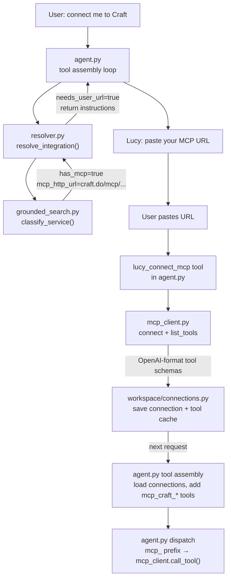

# MCP Client Integration Plan

## What's Being Fixed / Added

The resolver pipeline in `[resolver.py](src/lucy/integrations/resolver.py)` already designates MCP as Stage 1 (highest priority), but the current `[mcp_manager.py](src/lucy/integrations/mcp_manager.py)` only installs npm packages on a VPS and starts a process — there is no code that actually speaks the MCP protocol. This plan adds the missing client layer, targeting HTTP/SSE MCP servers (the modern standard used by Craft, Notion, Linear, etc.).

## Architecture




## Files to Create

### 1. `src/lucy/integrations/mcp_client.py` (new, ~180 lines)

The actual MCP protocol client. Uses the official `mcp` Python SDK.

Key responsibilities:

- `connect_and_discover(url) -> list[dict]` — opens an HTTP/SSE session, calls `session.list_tools()`, translates MCP tool schemas to OpenAI-compatible JSON (`{"type": "function", "function": {...}}`)
- `call_tool(url, tool_name, arguments) -> dict` — reconnects on-demand (stateless, per-call), calls `session.call_tool()`, returns result as dict
- Tool name translation: strips `mcp_{service}_` prefix before calling the MCP server; the MCP server sees its own native tool name
- Error handling follows Composio pattern: always returns `{"error": "..."}`, never raises

Transport: uses `mcp.client.streamable_http.streamable_http_client` for HTTP/SSE (handles Craft, Notion, Linear). Stdio (VPS-based) is out of scope for this plan — that's `mcp_manager.py`'s domain.

### 2. `src/lucy/workspace/connections.py` (new, ~100 lines)

Persists MCP connections per workspace in `data/mcp_connections.json` using the existing `WorkspaceFS` abstraction.

```python
@dataclass
class MCPConnectionRecord:
    service: str
    mcp_url: str
    tools_cache: list[dict]   # OpenAI-format schemas, refreshed on connect
    installed_at: str         # ISO8601
    updated_at: str

async def save_mcp_connection(ws: WorkspaceFS, record: MCPConnectionRecord) -> None
async def load_mcp_connections(ws: WorkspaceFS) -> list[MCPConnectionRecord]
async def delete_mcp_connection(ws: WorkspaceFS, service: str) -> bool
```

## Files to Modify

### 3. `src/lucy/integrations/grounded_search.py`

Add one field to `IntegrationClassification`:

- `mcp_http_url: str | None = None` — the HTTP/SSE MCP endpoint URL if one is publicly known (e.g. Craft's is user-generated so this would be `None`, but some services may publish a fixed one)

Update the `_CLASSIFICATION_PROMPT` to ask for `mcp_http_url` alongside `mcp_repo_url`.

### 4. `src/lucy/integrations/resolver.py`

Add a pre-Stage-1 check: if `classification.has_mcp` is true and the service requires a **user-provided URL** (i.e., no fixed `mcp_http_url`), return early with `result_data = {"status": "needs_user_mcp_url", "instructions": "..."}` instead of attempting VPS install. This tells the agent to ask the user for their URL.

The existing VPS-based Stage 1 (`install_mcp_server`) is left in place for services where Lucy can auto-install a stdio server.

### 5. `src/lucy/core/agent.py`

Two changes:

**Tool assembly** (near line 390 where tools list is built):

```python
# Load MCP connections and add their tools
mcp_connections = await load_mcp_connections(ws)
for conn in mcp_connections:
    # Tools are pre-cached; prefix names with mcp_{service}_
    for tool in conn.tools_cache:
        prefixed = _prefix_mcp_tool(tool, conn.service)
        tools.append(prefixed)
```

**Dispatch** (in `_execute_tool_call`, before the Composio catch-all):

```python
if tool_name.startswith("mcp_"):
    service, native_name = _parse_mcp_tool_name(tool_name)
    conn = _find_connection(mcp_connections, service)
    return await mcp_client.call_tool(conn.mcp_url, native_name, arguments)
```

**New internal tool** `lucy_connect_mcp`:

```python
{
  "name": "lucy_connect_mcp",
  "description": "Store a user-provided MCP URL and connect to it",
  "parameters": {
    "service": "string",   # e.g. "craft"
    "mcp_url": "string"    # the URL the user pasted
  }
}
```

When called: runs `mcp_client.connect_and_discover(url)` → saves to `workspace/connections.py` → returns summary of discovered tools.

### 6. `src/lucy/config.py`

Add one field:

```python
mcp_timeout_s: float = 30.0
```

### 7. `pyproject.toml`

Add dependency:

```toml
"mcp>=1.0,<2"
```

### 8. `src/lucy/workspace/__init__.py`

Export `load_mcp_connections`, `save_mcp_connection`, `delete_mcp_connection` from the new `connections.py`.

## The Slack Flow End-to-End

```
User:  "Lucy, connect me to Craft"
Lucy:  [runs resolver → detects needs_user_mcp_url]
       "Craft has an MCP connector. To set it up:
        1. Open Craft → Imagine tab → Add MCP Connection
        2. Name it 'Lucy', select your docs
        3. Copy the MCP URL it generates
        Paste the URL here and I'll connect."

User:  "https://mcp.craft.do/user/abc123..."
Lucy:  [calls lucy_connect_mcp(service="craft", mcp_url="https://...")]
       [mcp_client connects, discovers tools, saves to workspace]
       "Connected to Craft. I can now:
        - Search across your documents (craft_search_documents)
        - Create and update pages (craft_create_document)
        - Browse spaces and folders (craft_list_spaces)
        Try: 'find my notes on Q1 planning'"
```

On subsequent requests, the MCP tools appear automatically in Lucy's tool list for that workspace — no reconnection prompt needed.

## What This Explicitly Does NOT Change

- The VPS-based stdio MCP path in `mcp_manager.py` — left as-is
- Composio integration — unchanged, still Tier 1 for supported apps
- The OpenAPI and wrapper fallback stages — unchanged
- Auth for MCP: the URL is the credential (Craft embeds auth in the URL). No new OAuth flow needed.

