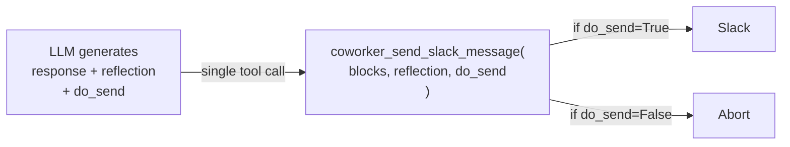
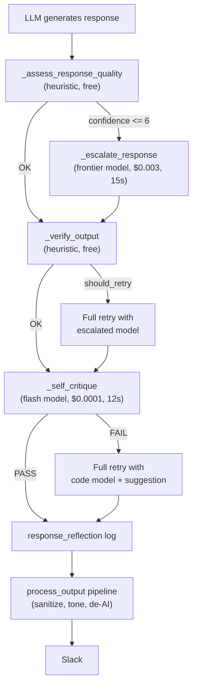

# Implement Viktor's True Reflection Pattern

## The Honest Comparison: What Viktor Does vs What Lucy Does

Viktor's reflection is architecturally elegant -- a **required parameter on the send tool** that costs ~50 tokens and zero extra latency:




Lucy's current "reflection" is a **multi-layered post-processing pipeline** with separate LLM calls, adding 12-27s latency and $0.001-0.003 per message:




**Key differences (not shortcuts -- fundamentally wrong architecture):**

- Viktor: 0 extra LLM calls, ~50 tokens overhead, always-on, has abort
- Lucy: 1-3 extra LLM calls, 500+ tokens overhead, conditional, no abort
- Viktor: Model thinks before acting (same call)
- Lucy: Separate models judge after acting (different calls)
- Viktor: Model can choose NOT to send (`do_send=False`)
- Lucy: Message ALWAYS gets sent -- no abort mechanism
- Viktor: Every message has a reflection (audit trail)
- Lucy: Reflection only logged when critique runs (skipped for short responses, fast intents)

The 10/10 test results proved the pipeline catches *some* issues, but they did NOT prove the system works like Viktor's. The system is slower, more expensive, more complex, and less effective than Viktor's approach.

## The Fix: Embed Reflection in the Model's Own Response

Since Lucy doesn't use a tool to send Slack messages (the handler does `say()` directly), we can't add parameters to a tool. The closest equivalent is to **make the model's final response a structured object** that includes reflection fields -- same call, same token budget, zero extra latency.

### Step 1: Add structured reflection to the response schema

Modify the system prompt ([prompts/SYSTEM_CORE.md](prompts/SYSTEM_CORE.md)) to require the model to wrap its final response:

```
When you are done (no more tool calls), output your final response in this format:

<lucy_reflection>
HELPFUL: [yes/no]
VALUE_FIRST: [yes/no]
ACCURATE: [yes/no]
CONFIDENCE: [1-10]
THOUGHT: [one sentence on quality]
</lucy_reflection>

[Your actual response to the user goes here, outside the tags]
```

This is ~40-60 extra tokens. Same LLM call. Zero extra latency.

### Step 2: Parse reflection from response in agent.py

In [src/lucy/core/agent.py](src/lucy/core/agent.py), after the agent loop returns `response_text`:

- Parse and strip the `<lucy_reflection>` block from the response text
- Extract confidence score and criteria results
- Log them as the `response_reflection` structured event (audit trail)
- If confidence < 5 or any critical criterion is "no": trigger ONE retry (existing retry mechanism)
- If confidence >= 8: skip tone validation in output pipeline (existing `skip_tone_validation` flag)

### Step 3: Remove the separate `_self_critique` LLM call

Remove the `_self_critique()` method and its call site (lines 1075-1093 in agent.py). The reflection is now embedded in the response itself -- no separate call needed.

This saves:

- 12s latency per message (the critique timeout)
- ~500 tokens per message (the critique prompt + response)
- One LLM call per message

### Step 4: Simplify the escalation flow

Keep `_assess_response_quality()` (it's free heuristics, costs nothing). But simplify `_escalate_response()`:

- Only trigger when confidence from reflection is very low (< 3) AND heuristic gate also flags issues
- This should be rare -- the reflection forces the model to catch its own problems

### Step 5: Add abort mechanism

In [src/lucy/slack/handlers.py](src/lucy/slack/handlers.py), after parsing the reflection:

- If confidence <= 2 and HELPFUL=no: do NOT send the response. Instead, trigger a full retry with the reflection as context (like Viktor's `do_send=False`)
- This gives the model the ability to abort a bad response

### Step 6: Always-on (remove conditional guards)

The current critique only runs when:

- `response_text` exists
- intent not in skip list
- no failure_context
- retry_depth == 0
- response length > 200

The embedded reflection has NONE of these guards. It's always present because it's part of the system prompt instruction. Every response, every time, every intent.

## Files to Change

- [prompts/SYSTEM_CORE.md](prompts/SYSTEM_CORE.md) -- Replace REFLECTION CHECKPOINT with structured `<lucy_reflection>` format instruction
- [src/lucy/core/agent.py](src/lucy/core/agent.py) -- Add `_parse_reflection()` to extract/strip reflection tags, remove `_self_critique()`, simplify escalation logic, wire up abort mechanism
- [src/lucy/slack/handlers.py](src/lucy/slack/handlers.py) -- Read parsed reflection, implement abort/retry, pass confidence to `process_output`
- [src/lucy/pipeline/output.py](src/lucy/pipeline/output.py) -- No major changes, keep `skip_tone_validation` parameter

## Net Result

- Extra LLM calls per message: 0 (down from 1-3)
- Extra tokens per message: ~50 (down from 500+)
- Extra latency per message: 0ms (down from 12-27s)
- Abort mechanism: Yes (down from no)
- Audit trail: Every message (up from conditional)
- Architecture complexity: Simpler (remove `_self_critique`, simplify `_escalate_response`)

