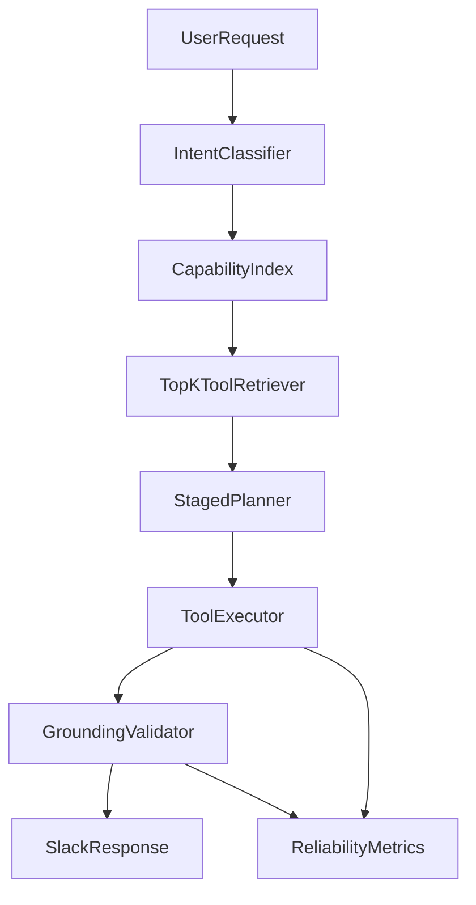

# Lucy Reliability And Scale Audit

Date: 2026-02-22
Scope: global tool-calling reliability, Composio alignment, and production scale readiness.

## Executive Summary

This is not an isolated calendar bug. The observed misses are symptoms of systemic agent risks:

1. Tool orchestration can loop or terminate without grounded final output.
2. Tool payload handling can still bias model behavior when responses are complex.
3. Integration execution lacks explicit connection-state and retry/circuit controls at every call site.
4. Current keyword-based app scoping is not sufficient for 1000 integrations / 7000 tools.

High-impact reliability guards were implemented immediately in the orchestrator and integration client layer (see "Implemented Now").

## Implemented Now (Code Changes)

### `src/lucy/core/agent.py`

- Added tool-loop safeguards:
  - repeated tool-call signature detection to break loops,
  - bounded tool-context growth with sliding window (`MAX_TOOL_CONTEXT_MESSAGES`),
  - stronger fallback behavior when loops do not produce final text.
- Added tool-call validation:
  - rejects unknown tool names not in the fetched tool set,
  - surfaces malformed tool arguments (`parse_error`) as structured tool errors.
- Added structured tool-error typing for downstream recovery hints (`retryable`, `auth`, `invalid_params`, `fatal`).
- Improved payload handling:
  - explicit truncation marker with removed char count,
  - compacted tool payload serialization to preserve key fields and list coverage.
- Added direct deterministic calendar fallback path for schedule-like queries if model fails to finalize.
- Added filtering of risky Composio meta-tools from model-facing tool list:
  - dropped `COMPOSIO_REMOTE_WORKBENCH`, `COMPOSIO_REMOTE_BASH_TOOL`,
  - retained safe orchestration tools.
- Added active-provider gating:
  - request-scoped apps must be connected/active or tool list is withheld.

### `src/lucy/routing/router.py` and `src/lucy/core/openclaw.py`

- Added explicit `parse_error` propagation for invalid JSON tool arguments from model tool-calls.

### `src/lucy/integrations/composio_client.py`

- Added missing compatibility methods used by registry/worker:
  - `get_entity_connections()`
  - `execute_action()`
  - `create_connection_link()`
- Added generic retry wrapper with exponential backoff for blocking Composio operations.
- Added short-lived caches for tool schemas and connected toolkits.
- Hardened session creation path with initialization checks.

### `src/lucy/integrations/registry.py`

- Added explicit cache invalidation helper and used it after sync.

## P0 / P1 / P2 Risk Register

### P0 (Critical)

1. Tool-call looping without semantic stop conditions.
   - Impact: user-facing failures, token/cost blowups.
   - Status: mitigated via repeated-signature break + max turn guard.

2. Unknown/hallucinated tool names executed without validation.
   - Impact: invalid actions, unstable recovery.
   - Status: mitigated with allowlist validation.

3. Silent argument JSON parse failures.
   - Impact: model thinks tool ran with intended params when it did not.
   - Status: mitigated with explicit parse error surfaced to tool layer.

4. Hard dependency on model producing final prose after tools.
   - Impact: `no_text` errors and failed responses.
   - Status: mitigated with deterministic finalization fallback.

### P1 (High)

1. Over-broad or unsafe model-visible tool surfaces.
   - Impact: irrelevant execution drift, latency inflation.
   - Status: partially mitigated with meta-tool filtering; further retrieval architecture needed.

2. Connection-state uncertainty before execution.
   - Impact: avoidable auth failures and hallucinated confidence.
   - Status: partially mitigated with active-provider gating; needs deeper per-tool auth checks.

3. Non-deterministic list completeness claims.
   - Impact: "that's all" false positives.
   - Status: improved via deterministic fallback path; needs generalized entity-level grounding checks.

### P2 (Medium)

1. Keyword-based app detection (`_detect_relevant_apps`) as primary routing heuristic.
2. No dedicated top-K capability retrieval or semantic ranking layer.
3. Limited production observability for reliability counters.

## Composio Strategic Assessment

Reference: [Composio Docs](https://docs.composio.dev/docs)

### What Composio recommends

- Session-first flow (`create(user_id)` + `session.tools()`).
- Meta-tools for discovery/execution.
- Provider-agnostic integration with clear auth and context handling.

### Where Lucy is aligned

- Uses session-based tooling and meta-tool orchestration.
- Uses workspace-scoped Composio identity.
- Supports discovery + multi-execute tool flow.

### Gaps at 1000 integrations / 7000 tools

1. Tool selection should be retrieval-based, not broad schema payloading.
2. Need capability index/ranking to keep model context lean and relevant.
3. Need stronger connection/auth-awareness at retrieval and execution stages.
4. Need resilient control plane (retries + breakers + stale cache policies + SLOs).

## Target Architecture For Large Tool Catalogs

Core components:

1. Capability registry (tool metadata + auth requirements + usage stats).
2. Top-K retrieval/ranking (semantic + usage + auth filter).
3. Staged tool planning (small candidate set first, expand only if needed).
4. Deterministic grounding validator before user-facing claims.
5. Reliability telemetry and adaptive controls.

## Production Rollout Roadmap

### Phase 1 (Immediate, 1-3 days): Reliability guards

- Keep the P0 protections implemented in this pass enabled.
- Add tests for:
  - unknown tool rejection,
  - parse-error propagation,
  - repeated tool-loop break,
  - non-empty finalization.

### Phase 2 (Short term, 3-7 days): Connection and claim safety

- Add explicit "connection required" user response templates for auth failures.
- Add claim validator for list questions:
  - if completeness cannot be guaranteed, avoid "all" claims.
- Add per-provider deterministic formatters for high-risk list intents.

### Phase 3 (Mid term, 1-2 weeks): Retrieval architecture

- Build capability index table and cache-backed schema retrieval.
- Replace keyword-only app scoping with top-K capability retrieval.
- Introduce staged planning.

### Phase 4 (Production hardening, 2-4 weeks): SLO and operations

- Add circuit breakers/time budgets/backpressure policy.
- Add dashboards and alerts for reliability metrics.
- Canary rollout with rollback playbook.

## SLOs And Quality Gates

### Core SLOs

- Tool-call success rate: >= 99%
- No-text finalization failures: <= 0.5%
- Hallucinated/unknown tool-call attempts: <= 0.1%
- p95 end-to-end latency (tool intents): <= 8s
- p95 tool retrieval latency: <= 500ms (cached path much lower)

### Regression gates

1. Thread auto-response correctness.
2. Schedule/list completeness and deterministic formatting.
3. Multi-turn tool call stability (no loops beyond cap).
4. Missing connection behavior (clear actionable error).

## What To Watch Next

1. If `COMPOSIO_SEARCH_TOOLS` still over-selects or loops, add tool-call planner heuristics before model step 2+.
2. Add provider-specific schema reducers so compacted payloads preserve critical fields per integration type.
3. Add offline replay tests from production transcripts to detect future regressions before deploy.

