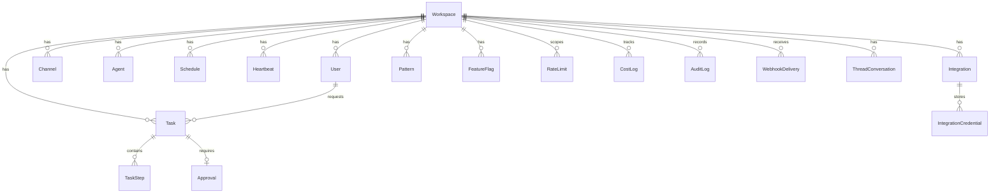

# Database Layer — Deep Dive

> All SQLAlchemy models, enums, session management, migrations, and the
> multi-tenant isolation pattern.

---

## Overview

Lucy uses PostgreSQL with async SQLAlchemy (`asyncpg` driver). Every model
is scoped to a `workspace_id` foreign key for multi-tenant isolation.
Time-series tables (CostLog, AuditLog, WebhookDelivery) are partitioned
by `year_month`.

---

## Entity-Relationship Diagram



---

## Enums

### TaskStatus

```
CREATED → PENDING_APPROVAL → RUNNING → COMPLETED
                                     → FAILED
                                     → CANCELLED
                                     → TIMEOUT
```

### TaskPriority

| Value | Use Case |
|-------|----------|
| `CRITICAL` | System-level, never queued |
| `HIGH` | Fast-tier requests |
| `NORMAL` | Default tier requests |
| `LOW` | Frontier-tier requests |
| `BATCH` | Background/bulk operations |

### ApprovalStatus

| Value | Meaning |
|-------|---------|
| `PENDING` | Awaiting user response |
| `APPROVED` | User clicked Approve |
| `REJECTED` | User clicked Cancel |
| `EXPIRED` | TTL exceeded (5 minutes) |

### IntegrationStatus

| Value | Meaning |
|-------|---------|
| `PENDING` | OAuth flow initiated |
| `ACTIVE` | Connected and working |
| `REFRESHING` | Token refresh in progress |
| `ERROR` | Connection broken |
| `REVOKED` | User revoked access |

### HeartbeatStatus

| Value | Meaning |
|-------|---------|
| `HEALTHY` | All checks passing |
| `TRIGGERED` | Condition fired, alert sent |
| `SILENCED` | Manually muted |
| `DISABLED` | Turned off |

---

## Core Models

### Workspace

Multi-tenant root entity. One per Slack workspace.

| Field | Type | Notes |
|-------|------|-------|
| `id` | UUID | Primary key |
| `slack_team_id` | String | Unique, Slack workspace ID |
| `name` | String | Workspace name |
| `domain` | String | Slack domain |
| `plan` | String | `starter` / `pro` / `enterprise` |
| `status` | String | `active` / `suspended` / `deleted` |
| `settings` | JSONB | Workspace-level preferences |
| `max_users` | Integer | Plan limit |
| `max_monthly_actions` | Integer | Plan limit |
| `max_integrations` | Integer | Plan limit |
| `current_month_actions` | Integer | Usage counter |
| `current_month_cost_usd` | Float | Monthly cost tracker |
| `created_at` | DateTime | Auto-set |
| `updated_at` | DateTime | Auto-updated |
| `deleted_at` | DateTime | Soft delete |

**Relationships:** `users`, `channels`, `tasks`, `agents`
**Indexes:** Unique on `slack_team_id`, composite on `(status, created_at)`

---

### User

| Field | Type | Notes |
|-------|------|-------|
| `id` | UUID | Primary key |
| `workspace_id` | UUID FK | → Workspace |
| `slack_user_id` | String | Slack user ID |
| `display_name` | String | Display name from Slack |
| `email` | String | Email address |
| `avatar_url` | String | Profile picture URL |
| `role` | String | `owner` / `admin` / `member` / `guest` |
| `preferences` | JSONB | User settings |
| `has_personal_agent` | Boolean | V2: personal agent enabled |
| `personal_agent_config` | JSONB | V2: personal agent settings |
| `is_active` | Boolean | Active flag |
| `last_seen_at` | DateTime | Updated via `touch()` |
| `created_at` | DateTime | Auto-set |
| `updated_at` | DateTime | Auto-updated |
| `deleted_at` | DateTime | Soft delete |

**Unique constraint:** `(workspace_id, slack_user_id)`
**Methods:** `touch()` updates `last_seen_at` to current time

---

### Channel

| Field | Type | Notes |
|-------|------|-------|
| `id` | UUID | Primary key |
| `workspace_id` | UUID FK | → Workspace |
| `slack_channel_id` | String | Slack channel ID |
| `name` | String | Channel name |
| `channel_type` | String | `public` / `private` / `im` / `mpim` |
| `lucy_joined_at` | DateTime | When Lucy joined |
| `is_monitored` | Boolean | Active monitoring flag |
| `settings` | JSONB | Channel-level preferences |
| `memory_scope_key` | String | Qdrant namespace (`ch:{slack_id}`) |
| `created_at` | DateTime | Auto-set |
| `updated_at` | DateTime | Auto-updated |
| `deleted_at` | DateTime | Soft delete |

**Unique constraint:** `(workspace_id, slack_channel_id)`

---

### Agent

V2-ready model supporting personal agents per user.

| Field | Type | Notes |
|-------|------|-------|
| `id` | UUID | Primary key |
| `workspace_id` | UUID FK | → Workspace |
| `agent_type` | String | `main` / `personal` / `custom` |
| `name` | String | Agent display name |
| `email_address` | String(255) | AgentMail address (nullable) |
| `owner_user_id` | UUID | For personal agents |
| `config` | JSONB | Agent configuration |
| `status` | String | `active` / `paused` / `deleted` |
| `total_tasks_completed` | Integer | Lifetime counter |
| `total_cost_usd` | Float | Lifetime cost |
| `created_at` | DateTime | Auto-set |
| `updated_at` | DateTime | Auto-updated |

---

### Task

Tracks every agent execution.

| Field | Type | Notes |
|-------|------|-------|
| `id` | UUID | Primary key |
| `workspace_id` | UUID FK | → Workspace |
| `agent_id` | UUID FK | → Agent |
| `requester_id` | UUID FK | → User |
| `channel_id` | UUID | Channel where requested |
| `slack_thread_ts` | String | Thread timestamp |
| `intent` | String | Router classification |
| `model_tier` | String | Model tier used |
| `priority` | TaskPriority | Enum |
| `status` | TaskStatus | Enum |
| `status_reason` | String | Why status changed |
| `created_at` | DateTime | Request received |
| `queued_at` | DateTime | Entered queue |
| `started_at` | DateTime | Agent loop started |
| `completed_at` | DateTime | Final response sent |
| `deadline_at` | DateTime | Optional deadline |
| `config` | JSONB | Execution config |
| `result_summary` | String | Brief result |
| `result_data` | JSONB | Full result payload |
| `error_count` | Integer | Total errors during execution |
| `last_error` | String | Most recent error |

**Relationships:** `workspace`, `requester`, `steps`, `approval`
**Indexes:** Partial index on active tasks (`status IN ('created', 'pending_approval', 'running')`)

---

### TaskStep

Individual steps within a task execution.

| Field | Type | Notes |
|-------|------|-------|
| `id` | UUID | Primary key |
| `task_id` | UUID FK | → Task |
| `sequence_number` | Integer | Step order |
| `step_type` | String | `llm_call` / `tool_use` / `approval_wait` / `sub_agent` / `sleep` |
| `description` | String | What this step does |
| `started_at` | DateTime | Step start |
| `completed_at` | DateTime | Step end |
| `config` | JSONB | Step parameters |
| `result` | JSONB | Step output |
| `error` | String | Error message |
| `retry_count` | Integer | Times retried |
| `created_at` | DateTime | Auto-set |

---

### Approval

HITL approval for destructive actions. One-to-one with Task.

| Field | Type | Notes |
|-------|------|-------|
| `id` | UUID | Primary key |
| `workspace_id` | UUID FK | → Workspace |
| `task_id` | UUID FK | → Task (unique) |
| `approver_id` | UUID | User who responded |
| `action_type` | String | Tool name |
| `action_description` | String | Human-readable description |
| `risk_level` | String | `low` / `medium` / `high` / `critical` |
| `status` | ApprovalStatus | Enum |
| `slack_message_ts` | String | Approval message timestamp |
| `response` | String | Approver's response |
| `responded_at` | DateTime | When responded |
| `expires_at` | DateTime | Auto-expire time |
| `created_at` | DateTime | Auto-set |
| `updated_at` | DateTime | Auto-updated |

**Indexes:** Partial index on pending approvals

---

### Schedule

Database-backed cron schedule (complement to filesystem `task.json`).

| Field | Type | Notes |
|-------|------|-------|
| `id` | UUID | Primary key |
| `workspace_id` | UUID FK | → Workspace |
| `name` | String | Schedule name |
| `description` | String | What it does |
| `cron_expression` | String | Cron syntax |
| `timezone` | String | IANA timezone |
| `intent_template` | String | Instruction template |
| `config` | JSONB | Extra configuration |
| `target_channel_id` | String | Where to post results |
| `is_active` | Boolean | Enabled/disabled |
| `last_run_at` | DateTime | Most recent run |
| `last_run_task_id` | UUID | Task from last run |
| `next_run_at` | DateTime | Next scheduled run |
| `run_count` | Integer | Total executions |
| `success_count` | Integer | Successful runs |
| `failure_count` | Integer | Failed runs |
| `created_at` | DateTime | Auto-set |
| `updated_at` | DateTime | Auto-updated |
| `deleted_at` | DateTime | Soft delete |

**Indexes:** `next_run_at` for scheduler queries

---

### Heartbeat

Real-time condition monitors. See [CRONS_HEARTBEAT.md](./CRONS_HEARTBEAT.md)
for the full monitoring system documentation.

| Field | Type | Notes |
|-------|------|-------|
| `id` | UUID | Primary key |
| `workspace_id` | UUID FK | → Workspace |
| `name` | String | Monitor name |
| `description` | String | Human description |
| `condition_type` | String | `metric_threshold` / `api_health` / `schedule_miss` / `custom` |
| `condition_config` | JSONB | Check parameters + `_slack_alert_channel` |
| `check_interval_seconds` | Integer | Default: 300 |
| `alert_channel_id` | UUID | Legacy field |
| `alert_template` | String | Alert message template |
| `alert_cooldown_seconds` | Integer | Default: 3600 |
| `last_alert_at` | DateTime | Last alert sent |
| `is_active` | Boolean | Active flag |
| `current_status` | HeartbeatStatus | Enum |
| `check_count` | Integer | Total checks run |
| `trigger_count` | Integer | Times triggered |
| `last_check_at` | DateTime | Last evaluation |
| `last_check_result` | JSONB | Result from last check |
| `created_at` | DateTime | Auto-set |
| `updated_at` | DateTime | Auto-updated |

---

### Integration

OAuth connections to third-party services.

| Field | Type | Notes |
|-------|------|-------|
| `id` | UUID | Primary key |
| `workspace_id` | UUID FK | → Workspace |
| `provider` | String | Service name (e.g., "google_calendar") |
| `external_account_id` | String | Provider's account ID |
| `external_account_name` | String | Display name |
| `scopes` | JSONB | Array of granted scopes |
| `status` | IntegrationStatus | Enum |
| `status_reason` | String | Why status changed |
| `token_expires_at` | DateTime | Token expiry |
| `last_refresh_at` | DateTime | Last token refresh |
| `last_health_check_at` | DateTime | Last health check |
| `last_health_status` | String | `healthy` / `degraded` / `error` |
| `provider_config` | JSONB | Provider-specific settings |
| `created_at` | DateTime | Auto-set |
| `updated_at` | DateTime | Auto-updated |
| `deleted_at` | DateTime | Soft delete |

---

### IntegrationCredential

Encrypted token storage for integrations.

| Field | Type | Notes |
|-------|------|-------|
| `id` | UUID | Primary key |
| `integration_id` | UUID FK | → Integration |
| `credential_type` | String | `access_token` / `refresh_token` / `api_key` / `client_secret` |
| `encrypted_value` | String | Encrypted with pgsodium in production |
| `created_at` | DateTime | Auto-set |
| `updated_at` | DateTime | Auto-updated |

---

### ThreadConversation

Tracks active Slack thread conversations.

| Field | Type | Notes |
|-------|------|-------|
| `id` | UUID | Primary key |
| `workspace_id` | UUID FK | → Workspace |
| `channel_id` | UUID FK | → Channel |
| `slack_channel_id` | String | Slack channel ID |
| `thread_ts` | String | Thread timestamp |
| `initiator_user_id` | UUID FK | → User |
| `slack_initiator_id` | String | Slack user ID |
| `is_active` | Boolean | Thread active flag |
| `status` | String | `active` / `paused` / `closed` |
| `participant_slack_ids` | JSONB | Array of participant Slack IDs |
| `message_count` | Integer | Messages in thread |
| `last_message_at` | DateTime | Most recent message |
| `lucy_last_responded_at` | DateTime | Lucy's last response |
| `auto_close_after_minutes` | Integer | Auto-close threshold |
| `last_intent` | String | Most recent intent classification |
| `conversation_summary` | String | Rolling summary |
| `last_task_id` | UUID | Last task in this thread |
| `created_at` | DateTime | Auto-set |
| `updated_at` | DateTime | Auto-updated |
| `closed_at` | DateTime | When thread was closed |

**Unique constraint:** `(channel_id, thread_ts)`

---

### Pattern

Detects recurring usage patterns for workflow suggestions.

| Field | Type | Notes |
|-------|------|-------|
| `id` | UUID | Primary key |
| `workspace_id` | UUID FK | → Workspace |
| `channel_id` | UUID FK | → Channel |
| `pattern_type` | String | `report_request` / `integration_use` / `topic_discussion` / `custom` |
| `topic` | String | Pattern topic |
| `first_seen_at` | DateTime | First occurrence |
| `last_seen_at` | DateTime | Most recent occurrence |
| `frequency_score` | Float | How often it recurs |
| `typical_requesters` | JSONB | Array of user IDs |
| `is_suggested` | Boolean | Suggestion sent to user |
| `suggested_at` | DateTime | When suggestion was sent |
| `suggestion_response` | String | `accepted` / `rejected` / `customize` / `pending` |
| `created_schedule_id` | UUID | If accepted, the created schedule |
| `created_at` | DateTime | Auto-set |
| `updated_at` | DateTime | Auto-updated |

---

## Time-Series Tables (Partitioned)

These tables are partitioned by `year_month` (format: `YYYY-MM`) for
efficient querying and retention management.

### CostLog

Tracks per-request costs for billing and analytics.

| Field | Type | Notes |
|-------|------|-------|
| `id` | UUID | Primary key |
| `workspace_id` | UUID FK | → Workspace |
| `task_id` | UUID | Related task |
| `component` | String | `llm_call` / `tool_execution` / `integration_api` / `sandbox` |
| `provider` | String | Service provider name |
| `model` | String | Model used |
| `input_tokens` | Integer | Prompt tokens |
| `output_tokens` | Integer | Completion tokens |
| `cost_usd` | Float | Computed cost |
| `request_metadata` | JSONB | Extra context |
| `year_month` | String | Partition key (`YYYY-MM`) |
| `created_at` | DateTime | Auto-set |

### AuditLog

Records all state-changing operations for compliance.

| Field | Type | Notes |
|-------|------|-------|
| `id` | UUID | Primary key |
| `workspace_id` | UUID FK | → Workspace |
| `actor_id` | UUID | Who performed the action |
| `actor_type` | String | `user` / `system` / `agent` / `integration` |
| `action` | String | Action name |
| `target_type` | String | Entity type affected |
| `target_id` | UUID | Entity affected |
| `before_state` | JSONB | State before change |
| `after_state` | JSONB | State after change |
| `ip_address` | String | Client IP |
| `user_agent` | String | Client user agent |
| `year_month` | String | Partition key |
| `created_at` | DateTime | Auto-set |

### WebhookDelivery

Tracks inbound webhook events.

| Field | Type | Notes |
|-------|------|-------|
| `id` | UUID | Primary key |
| `workspace_id` | UUID FK | → Workspace |
| `source` | String | Webhook source |
| `event_type` | String | Event type |
| `payload` | JSONB | Raw payload |
| `headers` | JSONB | Request headers |
| `status` | String | `pending` / `processing` / `completed` / `failed` / `ignored` |
| `processed_by` | String | Handler that processed it |
| `result` | JSONB | Processing result |
| `error` | String | Error message |
| `attempt_count` | Integer | Delivery attempts |
| `next_attempt_at` | DateTime | Retry schedule |
| `year_month` | String | Partition key |
| `created_at` | DateTime | Auto-set |
| `processed_at` | DateTime | When processed |

---

## Utility Models

### RateLimit

Database-backed rate limiting (complement to in-memory token buckets).

| Field | Type | Notes |
|-------|------|-------|
| `id` | UUID | Primary key |
| `scope_type` | String | `workspace` / `user` |
| `scope_id` | UUID | Workspace or user ID |
| `limit_type` | String | `requests_per_minute` / `tokens_per_day` / `tasks_per_hour` |
| `tokens_remaining` | Integer | Current tokens |
| `tokens_max` | Integer | Max capacity |
| `last_refill_at` | DateTime | Last refill |
| `window_start` | DateTime | Current window start |
| `window_requests` | Integer | Requests in current window |
| `updated_at` | DateTime | Auto-updated |

**Unique constraint:** `(scope_type, scope_id, limit_type)`

### FeatureFlag

Per-workspace feature flags with rollout control.

| Field | Type | Notes |
|-------|------|-------|
| `id` | UUID | Primary key |
| `workspace_id` | UUID FK | → Workspace |
| `flag_name` | String | Feature flag name |
| `is_enabled` | Boolean | Enabled/disabled |
| `rollout_percentage` | Integer | Gradual rollout (0-100) |
| `flag_config` | JSONB | Extra configuration |
| `created_at` | DateTime | Auto-set |
| `updated_at` | DateTime | Auto-updated |

**Unique constraint:** `(workspace_id, flag_name)`

---

## Session Management

**File:** `src/lucy/db/session.py`

### Engine Configuration

| Setting | Value | Purpose |
|---------|-------|---------|
| Pool size | 20 | Base connections |
| Max overflow | 20 | Extra connections (total: 40) |
| Pool timeout | 30s | Wait for available connection |
| Pool recycle | 3600s | Reconnect after 1 hour |
| Pool pre-ping | Enabled | Validate connections before use |
| Echo | False | SQL logging (True for debugging) |

### Session Factory

```python
AsyncSessionLocal = async_sessionmaker(
    engine,
    expire_on_commit=False,
    autocommit=False,
    autoflush=False,
)
```

### Access Patterns

| Function | Use Case |
|----------|----------|
| `get_db()` | FastAPI dependency — yields session, auto-rollback on exception |
| `db_session()` | Context manager — auto-commit on success, auto-rollback on exception |
| `init_db()` | Dev/test only — creates all tables (use Alembic in production) |
| `close_db()` | Shutdown — disposes all connections |

---

## Migrations

**Tool:** Alembic with async support

**Location:** `migrations/`

### Migration Files

| Revision | Date | Description |
|----------|------|-------------|
| `a1b2c3d4e5f6` | 2025-02-21 | Initial schema — all enums, all tables, all indexes |
| `b3f4e5a6d7c8` | 2025-02-24 | Add `email_address` column to `agents` table |

### Configuration

- `alembic.ini`: Points to `migrations/` directory
- `migrations/env.py`: Uses async engine, overrides URL from settings
- Post-write hooks: `ruff` formatting on generated files

### Running Migrations

```bash
alembic upgrade head        # Apply all pending migrations
alembic downgrade -1        # Roll back one migration
alembic revision --autogenerate -m "description"  # Generate new migration
```

---

## Multi-Tenant Isolation

Every model (except RateLimit) has a `workspace_id` foreign key pointing
to the Workspace table. This provides:

- **Data isolation:** Queries always filter by workspace_id
- **Cascade deletes:** Workspace deletion cascades to all child models
- **Index optimization:** Composite indexes include workspace_id
- **Soft deletes:** Most models use `deleted_at` instead of hard delete

### Custom JSONB Type

A custom `JSONB` TypeDecorator handles serialization of:
- UUID objects → string representation
- datetime objects → ISO format strings
- Enum values → string names

This ensures all JSONB columns can store complex nested data without
serialization errors.
