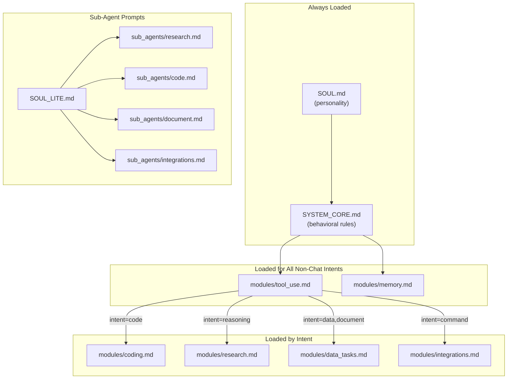

# Prompts Reference — Deep Dive

> Every prompt file that shapes Lucy's behavior, with section summaries
> and a loading cross-reference showing which prompts load for which intents.

---

## Prompt Loading Map

### Which Prompt Loads When

| Intent | SOUL.md | SYSTEM_CORE.md | tool_use.md | memory.md | Extra Module |
|--------|---------|---------------|-------------|-----------|-------------|
| `chat` | Yes | Yes | No | No | None |
| `greeting` | Yes | Yes | No | No | None |
| `confirmation` | Yes | Yes | No | No | None |
| `lookup` | Yes | Yes | Yes | Yes | None |
| `followup` | Yes | Yes | Yes | Yes | None |
| `tool_use` | Yes | Yes | Yes | Yes | None |
| `monitoring` | Yes | Yes | Yes | Yes | None |
| `code` | Yes | Yes | Yes | Yes | `coding.md` |
| `reasoning` | Yes | Yes | Yes | Yes | `research.md` |
| `data` | Yes | Yes | Yes | Yes | `data_tasks.md` |
| `document` | Yes | Yes | Yes | Yes | `data_tasks.md` |
| `command` | Yes | Yes | Yes | Yes | `integrations.md` |

Sub-agents load `SOUL_LITE.md` + their specific sub-agent prompt instead of
the full SOUL.md + SYSTEM_CORE.md stack.

---

## Root Prompt Files

### `prompts/SOUL.md` (~170 lines)

Lucy's personality and voice guide. Highest-priority personality source.

| Section | Key Rules |
|---------|-----------|
| **Identity & Anchor** | Lucy is a proactive teammate who delivers results, thinks ahead, improves over time. Directness + warmth + persistence. |
| **Voice & Tone** | 8 example pairs (good vs bad) covering: completing tasks, pushing back, handling uncertainty, celebrating, being proactive, working with data, giving status, saying no. |
| **Response Craft** | Answer first always. Specificity is warmth. Match energy. Vary structure. Short sentences earn long ones. 1-2 emojis per message. Bold the important parts. End naturally. Use contractions. Verify before asserting. Act directly. Parallelize independent steps. |
| **Abstraction Rules** | Never reveal tool names, backend infrastructure, file paths, API schemas, or technical jargon. Describe capabilities in plain English outcomes. |
| **Patterns to Avoid** | No em dashes (—). Limit semicolons and exclamation marks. Vocabulary blacklist: delve, tapestry, landscape, beacon, pivotal, leverage, etc. Transition blacklist: Moreover, Furthermore, Additionally, etc. Forbidden openers/closers. No "It's not X, it's Y" patterns. |

---

### `prompts/SYSTEM_CORE.md` (~381 lines)

Core behavioral instructions. Defines how Lucy thinks and acts.

| Section | Key Rules |
|---------|-----------|
| **Core Philosophy** | Act don't narrate. Ask smart questions. Be proactive not passive. |
| **Tool Restraint (CRITICAL)** | Never use tools for: date/time (already known), basic math, general knowledge, conversational messages. Tools are ONLY for private data and actions. |
| **Planning (MANDATORY)** | For multi-step tasks: define what user wants, success criteria, execution plan, anticipated failures. Only ask clarifying questions if genuinely ambiguous. |
| **How You Think About Tasks** | 8 principles: understand deeply (read knowledge files), investigate thoroughly (3+ sources), work by doing, quality-check everything, learn and update, acknowledge complex tasks, draft-review-iterate, code-first for data-heavy tasks. |
| **Self-Verification Checklist** | Before every response: addressed all parts? ALL records if "all data"? Files exist? Uploads happened? Counts match? Confidence level? Response matches effort? |
| **Abstraction Layer** | Never mention tool names, backend platforms, file paths, JSON, or error codes. Verify service names match user requests (e.g., Clerk != MoonClerk). |
| **Contextual Awareness** | Know environment (already in Slack). Know what you know (check integrations first). Use workspace memory. Challenge false premises. Search first, ask second. |
| **Error Handling** | Never fail, adapt: silent retry, pivot, partial delivery. Never say phrases implying struggle. Frame gaps as next steps. |
| **Formatting for Slack** | Headers (bold), dividers, bullets. No Markdown tables (use bulleted lists). Links with anchor text. Single asterisks for bold. TLDR-first rule. |
| **Writing Style** | No em dashes, power words blacklist, avoid parallelism, be assertive not hedgy, vary sentence length, clean headers. |
| **Tone and Personality** | Warm sharp colleague. Empathy first. Identity awareness (cross-reference Slack profiles). Match energy. Human openers. |
| **Response Quality** | Internal checklist. Proactive follow-up only when genuinely useful (skip for greetings, one-liners, or when nothing new to add). |
| **Skills System** | Read-write discipline: check relevant skills before acting, read full content, read company/team knowledge. After completing, update skills if learned something new. |

---

### `prompts/SYSTEM_PROMPT.md` (~513 lines)

Alternative structured prompt using XML-style sections. Loaded as fallback
if SYSTEM_CORE.md is missing.

| XML Section | Content |
|-------------|---------|
| `<core_philosophy>` | Act don't narrate, smart questions, proactive |
| `<work_methodology>` | 8 task principles (understand, investigate, do, verify, learn, acknowledge, iterate, code-first) |
| `<abstraction_layer>` | Hide internals, plain English, verify service names |
| `<contextual_awareness>` | Know environment, use memory, challenge premises |
| `<error_handling>` | Never fail, adapt: retry, pivot, partial delivery |
| `<formatting_for_slack>` | Visual hierarchy, no tables, anchor text links |
| `<tone_and_personality>` | Warm sharp colleague, match energy |
| `<research_and_verification>` | Confidence levels: API, search, training data, unsure. Deep research: multiple sources, cross-reference, cite. |
| `<skills_system>` | Read-write discipline, knowledge discovery |
| `<tool_efficiency>` | Answer from knowledge when possible, parallelize, investigate depth (2-3+ calls), minimize round trips |
| `<intelligence_rules>` | Check connections for integration queries, ask WHERE for data queries, flag contradictions, check silently for impossible requests |
| `<response_quality>` | Internal checklist, proactive follow-up when genuinely useful |
| `<slack_history_awareness>` | MANDATORY: search Slack history for past events |
| `<memory_discipline>` | Three layers: thread, session, knowledge. Persist facts. |
| `<proactive_intelligence>` | Pattern recognition, follow-up awareness, contextual suggestions |
| `<operating_rules>` | 10 rules: verify, no hallucination, log, one-concern-one-message, respect hours, learn from failures, focus, confirm destructive, parallelize, clean up |
| `<autonomous_coding>` | Draft → lint (py_compile) → test → edit → iterate. CRITICAL: never describe and stop, never paste for confirmation. |
| `<custom_integration_workflow>` | Search → honest disclosure → consent → resolve → API key → store → verify → report. Removal: confirm → preview → wait → delete → confirm. |

---

### `prompts/SOUL_LITE.md` (~15 lines)

Minimal personality for sub-agents. Contains only:

1. **Core Behavior:** Act don't narrate. Execute and return results. Be direct and thorough. Never fabricate data.
2. **Abstraction Rules (CRITICAL):** Never reveal tool names, file paths, backend names, JSON, error codes, or technical jargon. Describe outcomes in plain English.

This is intentionally stripped down — sub-agents don't need the full
personality stack since their output is consumed by the main agent, not
shown directly to users.

---

### `prompts/HEARTBEAT.md` (~31 lines)

Checklist for the proactive heartbeat cron. Run every 30 minutes.

| Check | What To Do |
|-------|-----------|
| **1. Unanswered Questions** | Scan `logs/slack_reader/` for messages since last heartbeat. If someone asked with no reply, answer or offer help. |
| **2. Task Follow-ups** | Scan `logs/global.log` for recent cron outputs and task completions. Share useful data proactively. Investigate failures. |
| **3. Pending Items** | Check `data/session_memory.json` for items tagged pending/follow-up. If now resolvable, act. |
| **4. Team Awareness** | If learned something new, consider sharing if genuinely useful. |

**Rules:** At most ONE visible action per heartbeat. If nothing needs attention, respond `HEARTBEAT_OK`. Never create/modify cron jobs during heartbeat. Never ask clarifying questions.

---

## Module Files

### `prompts/modules/tool_use.md` (~185 lines)

The largest module. Loaded for all non-chat intents.

| Section | Key Rules |
|---------|-----------|
| **Tool Usage** | Answer from knowledge when possible. Only tools for live/external data. Parallelize independent requests. Execute, never narrate. 2-3+ tool calls minimum for investigation depth. |
| **Integration Connections (CRITICAL)** | Use COMPOSIO_MANAGE_CONNECTIONS for connection checks. Never fabricate OAuth URLs. If service unsupported: disclose honestly, offer custom integration, wait for consent. |
| **Scheduled Tasks** | `lucy_create_cron` for recurring tasks. Delivery routing (channel vs DM). Write descriptions as instructions for what Lucy should DO. |
| **Monitoring & Alerting (CRITICAL)** | Two systems: Heartbeat Monitors (instant alerts, lightweight HTTP checks every 30s-5min) and Cron Jobs (periodic reports needing LLM intelligence). Decision tree based on urgency, complexity, and cost. Key distinction: monitoring request != fetch current data. |
| **Intelligence Rules** | Check connections live for integration queries. Ask WHERE for data queries. Flag contradictions. Check silently for impossible requests. |
| **Operating Rules** | 10 rules: verify, no hallucination, log, one-concern-one-message, respect hours, learn from failures, focus, confirm destructive, parallelize, clean up. |

---

### `prompts/modules/data_tasks.md` (~43 lines)

Loaded for `data` and `document` intents.

| Phase | Rules |
|-------|-------|
| **Phase 1: UNDERSTAND** | Define success before calling tools. "All data" means EVERY record, not a sample. |
| **Phase 2: FETCH** | CRITICAL: Data tools return SAMPLES of 20 by default. For Excel/spreadsheet: use `export_excel=true` for ALL records. For quick lookups: default settings fine. |
| **Phase 3: RESPOND** | State exact counts, describe sheets, upload to Google Drive if requested. |
| **Rules** | Always use `export_excel=true` for reports. Use `lucy_generate_excel` only for custom multi-source data. When in doubt about "all" vs "some", assume "all". |

---

### `prompts/modules/research.md` (~17 lines)

Loaded for `reasoning` intent.

| Section | Rules |
|---------|-------|
| **Confidence Transparency** | State source: computed from live API, found via search, from training data, or unsure. |
| **Deep Research Protocol** | Acknowledge scope upfront. Use MULTIPLE sources. Cross-reference facts. Cite sources. Distinguish verified from estimates. Offer to export findings as document if data-dense. |

---

### `prompts/modules/memory.md` (~44 lines)

Loaded for all non-chat intents.

| Section | Rules |
|---------|-------|
| **Memory Discipline** | Three layers: thread (conversation), session (recent facts), knowledge (permanent). USE ALL OF THEM. |
| **Persisting Facts** | Company facts → company knowledge. Team facts → team knowledge. Other context → session memory. CRITICAL: Actually persist, don't just acknowledge. |
| **Recalling Information** | Check session memory and knowledge BEFORE claiming you don't know. Use injected context directly. Reference source naturally. |
| **Slack History** | MANDATORY: Search history for ANY question about past events. Reference findings naturally. |

---

### `prompts/modules/integrations.md` (~25 lines)

Loaded for `command` intent.

| Section | Rules |
|---------|-------|
| **Custom Integration Workflow** | Search first, be honest, wait for consent, call resolver, ask for API key, store, verify, report. NEVER generate fake Composio links. NEVER suggest scraping. NEVER confuse similar names. |
| **Removing Integrations** | Confirm which one → preview with `confirmed=false` → tell user what they'll lose → wait for explicit confirmation → delete with `confirmed=true` → confirm removal. |

---

### `prompts/modules/coding.md` (~18 lines)

Loaded for `code` intent.

| Section | Rules |
|---------|-------|
| **Autonomous Coding** | Exact workflow: drafting → linting (`python -m py_compile`) → testing → targeted editing (SEARCH/REPLACE) → iterate. |
| **CRITICAL RULES** | Never describe fix and stop. Never paste code asking for confirmation. Re-run lint after every edit. Complete entire cycle autonomously. |

---

## Sub-Agent Prompts

All sub-agent prompts share the same **Writing Rules** appendix:
- Output posted directly to Slack
- No em dashes/en dashes
- Vocabulary blacklist enforced
- No formal transitions
- No forbidden openers/closers
- Mix sentence lengths, be direct
- Use Slack formatting: `*bold*`, `_italic_`

### `prompts/sub_agents/research.md` (~20 lines)

| Section | Content |
|---------|---------|
| **Role** | Search web systematically, cross-reference across 3+ sources, return structured findings with source URLs, distinguish verified from estimates, never fabricate. |

### `prompts/sub_agents/code.md` (~20 lines)

| Section | Content |
|---------|---------|
| **Role** | Write, debug, and review code using exec/read/write tools. Always test before returning. Fix errors yourself. Include error handling. Lint (`python -m py_compile`) before declaring success. |

### `prompts/sub_agents/document.md` (~21 lines)

| Section | Content |
|---------|---------|
| **Role** | Create professional, client-facing content. Clear structure (title, sections, subsections). Professional but accessible language. Include data/evidence/citations. Review draft critically before finalizing. Quality is paramount. |

### `prompts/sub_agents/integrations.md` (~19 lines)

| Section | Content |
|---------|---------|
| **Role** | Connect services using Composio tools. If service not found, use custom integration resolver. Verify connections by making test call. Report capabilities in plain English. |

---

## Cross-System Effects

| If You Change... | Also Check... |
|-----------------|---------------|
| `SOUL.md` personality | `_REPHRASER_PROMPT` in `humanize.py` (should match voice) |
| `SYSTEM_CORE.md` planning rules | `supervisor.py` plan generation prompt |
| `SYSTEM_CORE.md` verification checklist | `_verify_output()` in `agent.py` (heuristic checks) |
| Anti-pattern vocabulary | `_REGEX_DEAI_PATTERNS` in `output.py` (should match) |
| Module file content | Router `INTENT_MODULES` mapping (must reference it) |
| Sub-agent writing rules | `_POOL_GENERATOR_PROMPT` in `humanize.py` |
| `HEARTBEAT.md` checklist | `workspace_seeds/crons/heartbeat/task.json` description |
| `SOUL_LITE.md` | `_load_soul_lite()` in `sub_agents.py` |
